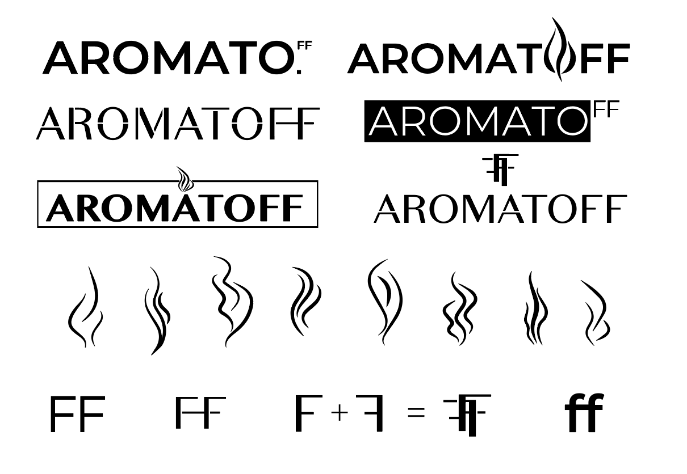
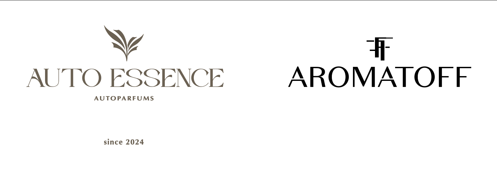

# Case Study: Aromatoff — Scent Redefined

## 🕯️ Project Overview

**Aromatoff** is a fragrance brand that went through a complete transformation — from name and product concept to a bold new visual identity. Originally launched as *Auto Essence* (yes, even car perfumes can glow up), the brand decided to pivot toward a more sophisticated lifestyle segment, focusing on scented candles and aroma sprays.

**My task was to lead the rebranding:** visual system and style that could grow and evolve — just like the people lighting those candles.

---

## 🧠 Concept & Background

After some time on the market, the client decided that it was time to *leave the past behind, elegantly*. They wanted a shift:

- From *soft & decorative* → to *structured & modern*  
- From *generic* → to *expressive and memorable*

They came to me with a simple request:  
> “We want something bold, but also poetic. Something strict, but still emotional.”

And so **Aromatoff** was born — a name that evokes scent (*aroma*), softness (*off* like a whisper), and a touch of timeless elegance that feels both international and intimate.

---

## 🛠 Process

We started from scratch, so every part of the brand identity was reconsidered:

- A new name to reflect a calmer, more mature mood  
- A visual concept that could flex and adapt to different scents and packaging  
- A modular brand system where mood, color, and pattern could shift with every product line

---

## 🔤 Logo

The main wordmark is set in a clean serif with a sharp, geometric twist — particularly visible in the stylized **A**s with extended legs. It’s minimal, modern, and full of subtle personality.

Above the wordmark sits a **monogram** made of two mirrored “F”s, forming an **A** in the negative space — a clever nod to the brand name. This symbol works as a seal or icon across applications and embodies the new conceptual depth.

| Before                     | After                                              |
|---------------------------|----------------------------------------------------|
| *subtle serif leaf logo*  | *modern, elegant black-on-white system*            |

---

## 🎨 Color & Flexibility

At the brand's core lies a **monochrome system**: black and white are used to create a sense of calm elegance. This also allows the design to adapt to each scent.

Each fragrance uses its own **color variation and marbled pattern**, inspired by the emotion of the aroma.

> *Cherry*, for example, gets dark red swirls — rich and intense, just like biting into the fruit too soon and pretending you’re fine.

---

## 🌀 Pattern System

The swirling patterns are more than just visual flair — they serve as **emotional landscapes** for each scent. Each one was crafted and carefully refined to evoke the essence of the fragrance: like flowing ink, rising smoke, or softly melting wax.

They help translate aroma into mood and appear across various brand touchpoints, including:

- Product labels  
- Packaging boxes  
- Print collateral  

_(Insert pattern examples here)_

---

## 🍒 Real Product Example: “Cherry”

For the *Cherry* scent — used on both a soy wax candle and room spray — I created:

- Custom label with marbled red-black pattern  
- Clear scent name in script font for a touch of softness  
- Amber glass packaging for warmth and depth

> It’s giving: *one perfectly sliced cherry tart.*

_(Insert Cherry product images here)_

---

## ⚠️ Challenge

The biggest challenge was making something strict — but not boring. The original brand leaned decorative, so swinging too far into minimalism risked losing warmth.

The solution? A system of contrasts:

- clean logo / expressive patterns  
- monochrome base / shifting color per scent

---

## ✅ Outcome

The result is a flexible, elegant identity that can grow with the brand and hold many product variations without losing cohesion. **Aromatoff** is now a brand that speaks in **textures**, not trends — and whispers *“premium”* without screaming it.

---

